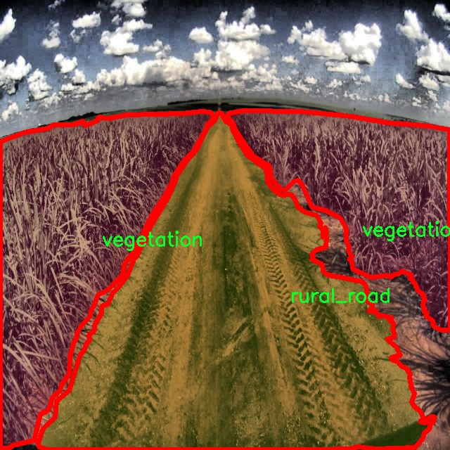

### 1.背景意义

研究背景与意义

随着城市化进程的加快，农村地区的交通状况逐渐受到重视。农村非城市交通场景的复杂性和多样性，使得传统的交通监测和管理手段面临诸多挑战。尤其是在图像识别和分割技术的应用上，如何准确地识别和分割交通场景中的不同元素，成为了一个亟待解决的问题。基于此背景，开发一个高效的图像分割系统，能够在农村非城市交通场景中准确识别和分类各种交通对象，如汽车、摩托车、行人、道路、乡村道路、卡车和植被等，具有重要的理论和实际意义。

本研究旨在基于改进的YOLOv11模型，构建一个针对农村非城市交通场景的图像分割系统。YOLO（You Only Look Once）系列模型以其高效的实时检测能力而广受欢迎，而YOLOv11的改进版本在准确性和速度上都有了显著提升。通过对1000幅图像进行实例分割，系统能够有效识别出七个主要类别，涵盖了交通场景中的关键元素。这一系统不仅可以为交通管理提供数据支持，还能够为智能交通系统的建设奠定基础。

此外，农村地区的交通安全问题日益凸显，准确的交通监测和分析能够为政策制定者提供科学依据，帮助改善交通设施和规划，降低交通事故发生率。通过对农村交通场景的深入研究，我们能够更好地理解其独特性和复杂性，从而推动相关技术的发展和应用。因此，基于改进YOLOv11的农村非城市交通场景图像分割系统的研究，不仅是对计算机视觉技术的一次探索，更是对农村交通管理和安全保障的重要贡献。

### 2.视频效果

[2.1 视频效果](https://www.bilibili.com/video/BV13ZkkYpECM/)

### 3.图片效果


##### [项目涉及的源码数据来源链接](https://kdocs.cn/l/cszuIiCKVNis)**

注意：本项目提供训练的数据集和训练教程,由于版本持续更新,暂不提供权重文件（best.pt）,请按照6.训练教程进行训练后实现上图演示的效果。

### 4.数据集信息

##### 4.1 本项目数据集类别数＆类别名

nc: 7
names: ['car', 'motorcycle', 'person', 'road', 'rural_road', 'truck', 'vegetation']


该项目为【图像分割】数据集，请在【训练教程和Web端加载模型教程（第三步）】这一步的时候按照【图像分割】部分的教程来训练

##### 4.2 本项目数据集信息介绍

本项目数据集信息介绍

本项目旨在改进YOLOv11的农村非城市交通场景图像分割系统，为此我们构建了一个专门的数据集，名为“segmentacaoArtigo”。该数据集涵盖了多种与农村交通相关的物体和环境特征，包含七个主要类别，分别为汽车、摩托车、行人、道路、乡村道路、卡车和植被。这些类别的选择不仅反映了农村交通场景的多样性，也为模型的训练提供了丰富的标注数据。

在数据集的构建过程中，我们精心挑选了来自不同农村地区的图像，以确保数据的多样性和代表性。这些图像涵盖了不同的天气条件、时间段以及交通密度，从而使得模型在训练过程中能够学习到更为复杂的特征和模式。每一类物体的标注都经过严格审核，确保其准确性和一致性，为后续的图像分割任务奠定了坚实的基础。

通过使用该数据集，我们期望能够提升YOLOv11在农村非城市交通场景中的表现，尤其是在物体检测和分割的精度上。该数据集不仅适用于训练模型，还可以作为评估模型性能的基准，帮助研究人员和开发者更好地理解和优化图像分割算法。随着农村交通场景的复杂性不断增加，利用这样的数据集进行深入研究，将为未来的智能交通系统提供重要的支持和参考。我们相信，通过不断完善和扩展这一数据集，能够为农村交通安全和管理提供更为有效的技术解决方案。





### 5.全套项目环境部署视频教程（零基础手把手教学）

[5.1 所需软件PyCharm和Anaconda安装教程（第一步）](https://www.bilibili.com/video/BV1BoC1YCEKi/?spm_id_from=333.999.0.0&vd_source=bc9aec86d164b67a7004b996143742dc)


[5.2 安装Python虚拟环境创建和依赖库安装视频教程（第二步）](https://www.bilibili.com/video/BV1ZoC1YCEBw?spm_id_from=333.788.videopod.sections&vd_source=bc9aec86d164b67a7004b996143742dc)

### 6.改进YOLOv11训练教程和Web_UI前端加载模型教程（零基础手把手教学）

[6.1 改进YOLOv11训练教程和Web_UI前端加载模型教程（第三步）](https://www.bilibili.com/video/BV1BoC1YCEhR?spm_id_from=333.788.videopod.sections&vd_source=bc9aec86d164b67a7004b996143742dc)


按照上面的训练视频教程链接加载项目提供的数据集，运行train.py即可开始训练



     Epoch   gpu_mem       box       obj       cls    labels  img_size
     1/200     20.8G   0.01576   0.01955  0.007536        22      1280: 100%|██████████| 849/849 [14:42<00:00,  1.04s/it]
               Class     Images     Labels          P          R     mAP@.5 mAP@.5:.95: 100%|██████████| 213/213 [01:14<00:00,  2.87it/s]
                 all       3395      17314      0.994      0.957      0.0957      0.0843

     Epoch   gpu_mem       box       obj       cls    labels  img_size
     2/200     20.8G   0.01578   0.01923  0.007006        22      1280: 100%|██████████| 849/849 [14:44<00:00,  1.04s/it]
               Class     Images     Labels          P          R     mAP@.5 mAP@.5:.95: 100%|██████████| 213/213 [01:12<00:00,  2.95it/s]
                 all       3395      17314      0.996      0.956      0.0957      0.0845

     Epoch   gpu_mem       box       obj       cls    labels  img_size
     3/200     20.8G   0.01561    0.0191  0.006895        27      1280: 100%|██████████| 849/849 [10:56<00:00,  1.29it/s]
               Class     Images     Labels          P          R     mAP@.5 mAP@.5:.95: 100%|███████   | 187/213 [00:52<00:00,  4.04it/s]
                 all       3395      17314      0.996      0.957      0.0957      0.0845


###### [项目数据集下载链接](https://kdocs.cn/l/cszuIiCKVNis)

### 7.原始YOLOv11算法讲解

YOLOv11是一种由Ultralytics公司开发的最新一代目标检测模型，以其增强的特征提取能力和更高的效率在计算机视觉领域引人注目。该模型在架构上进行了关键升级，通过更新主干和颈部结构，显著提高了对复杂视觉场景的理解和处理精度。YOLOv11不仅在目标检测上表现出色，还支持实例分割、图像分类、姿态估计和定向目标检测（OBB）等任务，展示出其多功能性。

与其前身YOLOv8相比，YOLOv11在设计上实现了深度和宽度的改变，同时引入了几个创新机制。其中，C3k2机制是对YOLOv8中的C2f的改进，提升了浅层特征的处理能力；C2PSA机制则进一步优化了特征图的处理流程。解耦头的创新设计，通过增加两个深度卷积（DWConv），提高了模型对细节的感知能力和分类准确性。

在性能上，YOLOv11m模型在COCO数据集上的平均精度（mAP）提高，并减少了22%的参数量，确保了在运算效率上的突破。该模型可以部署在多种平台上，包括边缘设备、云平台以及支持NVIDIA GPU的系统，彰显出卓越的灵活性和适应性。总体而言，YOLOv11通过一系列的创新突破，对目标检测领域产生了深远的影响，并为未来的开发提供了新的研究方向。


****文档**** ： _ _https://docs.ultralytics.com/models/yolo11/__

****代码链接**** ： _ _https://github.com/ultralytics/ultralytics__

******Performance Metrics******


​ ** **关键特性****

****◆**** ** **增强的特征提取能力**** ：YOLO11采用了改进的主干和颈部架构，增强了 ** **特征提取****
能力，能够实现更精确的目标检测和复杂任务的执行。

****◆**** ** **优化的效率和速度****
：YOLO11引入了精细化的架构设计和优化的训练流程，提供更快的处理速度，并在准确性和性能之间保持最佳平衡。

****◆**** ** **参数更少、精度更高****
：通过模型设计的改进，YOLO11m在COCO数据集上实现了更高的平均精度（mAP），同时使用的参数比YOLOv8m少22%，使其在计算上更加高效，而不牺牲准确性。

****◆**** ** **跨环境的适应性**** ：YOLO11可以无缝部署在各种环境中，包括边缘设备、云平台和支持NVIDIA
GPU的系统，确保最大的灵活性。

****◆**** ** **支持广泛任务****
：无论是目标检测、实例分割、图像分类、姿态估计还是定向目标检测（OBB），YOLO11都旨在应对一系列计算机视觉挑战。

****支持的任务和模式****


​YOLO11建立在YOLOv8中引入的多功能模型范围之上，为各种计算机视觉任务提供增强的支持:


​该表提供了YOLO11模型变体的概述，展示了它们在特定任务中的适用性以及与Inference、Validation、Training和Export等操作模式的兼容性。从实时检测到复杂的分割任务
，这种灵活性使YOLO11适用于计算机视觉的广泛应用。

##### yolov11的创新

■ yolov8 VS yolov11

YOLOv5，YOLOv8和YOLOv11均是ultralytics公司的作品，ultralytics出品必属精品。


​ **具体创新点** ：

**① 深度（depth）和宽度 （width）**

YOLOv8和YOLOv11是基本上完全不同。

**② C3k2机制**

C3k2有参数为c3k，其中在网络的浅层c3k设置为False。C3k2就相当于YOLOv8中的C2f。


​ **③ C2PSA机制**

下图为C2PSA机制的原理图。


​ **④ 解耦头**

解耦头中的分类检测头增加了两个 **DWConv** 。


▲Conv

    
    
    def autopad(k, p=None, d=1):  # kernel, padding, dilation
    
        """Pad to 'same' shape outputs."""
    
        if d > 1:
    
            k = d * (k - 1) + 1 if isinstance(k, int) else [d * (x - 1) + 1 for x in k]  # actual kernel-size
    
        if p is None:
    
            p = k // 2 if isinstance(k, int) else [x // 2 for x in k]  # auto-pad
    
    return p
    
    
    class Conv(nn.Module):
    
        """Standard convolution with args(ch_in, ch_out, kernel, stride, padding, groups, dilation, activation)."""
    
    
        default_act = nn.SiLU()  # default activation
    
    
        def __init__(self, c1, c2, k=1, s=1, p=None, g=1, d=1, act=True):
    
            """Initialize Conv layer with given arguments including activation."""
    
            super().__init__()
    
            self.conv = nn.Conv2d(c1, c2, k, s, autopad(k, p, d), groups=g, dilation=d, bias=False)
    
            self.bn = nn.BatchNorm2d(c2)
    
            self.act = self.default_act if act is True else act if isinstance(act, nn.Module) else nn.Identity()
    
    
        def forward(self, x):
    
            """Apply convolution, batch normalization and activation to input tensor."""
    
            return self.act(self.bn(self.conv(x)))
    
    
        def forward_fuse(self, x):
    
            """Perform transposed convolution of 2D data."""
    
            return self.act(self.conv(x))

▲Conv2d

    
    
    torch.nn.Conv2d(in_channels, out_channels, kernel_size, stride=1, padding=0, dilation=1, groups=1, bias=True, padding_mode='zeros')

▲DWConv

DWConv ** **代表 Depthwise Convolution（深度卷积）****
，是一种在卷积神经网络中常用的高效卷积操作。它主要用于减少计算复杂度和参数量。

    
    
    class DWConv(Conv):
    
        """Depth-wise convolution."""
    
    
        def __init__(self, c1, c2, k=1, s=1, d=1, act=True):  # ch_in, ch_out, kernel, stride, dilation, activation
    
            """Initialize Depth-wise convolution with given parameters."""
    
            super().__init__(c1, c2, k, s, g=math.gcd(c1, c2), d=d, act=act)


### 8.200+种全套改进YOLOV11创新点原理讲解

#### 8.1 200+种全套改进YOLOV11创新点原理讲解大全

由于篇幅限制，每个创新点的具体原理讲解就不全部展开，具体见下列网址中的改进模块对应项目的技术原理博客网址【Blog】（创新点均为模块化搭建，原理适配YOLOv5~YOLOv11等各种版本）

[改进模块技术原理博客【Blog】网址链接](https://gitee.com/qunmasj/good)


#### 8.2 精选部分改进YOLOV11创新点原理讲解

###### 这里节选部分改进创新点展开原理讲解(完整的改进原理见上图和[改进模块技术原理博客链接](https://gitee.com/qunmasj/good)【如果此小节的图加载失败可以通过CSDN或者Github搜索该博客的标题访问原始博客，原始博客图片显示正常】

### Gold-YOLO简介
YOLO再升级：华为诺亚提出Gold-YOLO，聚集-分发机制打造新SOTA
在过去的几年中，YOLO系列模型已经成为实时目标检测领域的领先方法。许多研究通过修改架构、增加数据和设计新的损失函数，将基线推向了更高的水平。然而以前的模型仍然存在信息融合问题，尽管特征金字塔网络（FPN）和路径聚合网络（PANet）已经在一定程度上缓解了这个问题。因此，本研究提出了一种先进的聚集和分发机制（GD机制），该机制通过卷积和自注意力操作实现。这种新设计的模型被称为Gold-YOLO，它提升了多尺度特征融合能力，在所有模型尺度上实现了延迟和准确性的理想平衡。此外，本文首次在YOLO系列中实现了MAE风格的预训练，使得YOLO系列模型能够从无监督预训练中受益。Gold-YOLO-N在COCO val2017数据集上实现了出色的39.9% AP，并在T4 GPU上实现了1030 FPS，超过了之前的SOTA模型YOLOv6-3.0-N，其FPS相似，但性能提升了2.4%。


#### Gold-YOLO


YOLO系列的中间层结构采用了传统的FPN结构，其中包含多个分支用于多尺度特征融合。然而，它只充分融合来自相邻级别的特征，对于其他层次的信息只能间接地进行“递归”获取。

传统的FPN结构在信息传输过程中存在丢失大量信息的问题。这是因为层之间的信息交互仅限于中间层选择的信息，未被选择的信息在传输过程中被丢弃。这种情况导致某个Level的信息只能充分辅助相邻层，而对其他全局层的帮助较弱。因此，整体上信息融合的有效性可能受到限制。
为了避免在传输过程中丢失信息，本文采用了一种新颖的“聚集和分发”机制（GD），放弃了原始的递归方法。该机制使用一个统一的模块来收集和融合所有Level的信息，并将其分发到不同的Level。通过这种方式，作者不仅避免了传统FPN结构固有的信息丢失问题，还增强了中间层的部分信息融合能力，而且并没有显著增加延迟。


# 8.低阶聚合和分发分支 Low-stage gather-and-distribute branch
从主干网络中选择输出的B2、B3、B4、B5特征进行融合，以获取保留小目标信息的高分辨率特征。


低阶特征对齐模块 (Low-stage feature alignment module)： 在低阶特征对齐模块（Low-FAM）中，采用平均池化（AvgPool）操作对输入特征进行下采样，以实现统一的大小。通过将特征调整为组中最小的特征大小（ R B 4 = 1 / 4 R ） （R_{B4} = 1/4R）（R 
B4 =1/4R），我们得到对齐后的特征F a l i g n F_{align}F align 。低阶特征对齐技术确保了信息的高效聚合，同时通过变换器模块来最小化后续处理的计算复杂性。其中选择 R B 4 R_{B4}R B4 作为特征对齐的目标大小主要基于保留更多的低层信息的同时不会带来较大的计算延迟。
低阶信息融合模块(Low-stage information fusion module)： 低阶信息融合模块（Low-IFM）设计包括多层重新参数化卷积块（RepBlock）和分裂操作。具体而言，RepBlock以F a l i g n ( c h a n n e l = s u m ( C B 2 ， C B 3 ， C B 4 ， C B 5 ) ) F_{align} (channel= sum(C_{B2}，C_{B3}，C_{B4}，C_{B5}))F align (channel=sum(C B2 ，C B3 ，C B4 ，C B5 )作为输入，并生成F f u s e ( c h a n n e l = C B 4 + C B 5 ) F_{fuse} (channel= C_{B4} + C_{B5})F fuse (channel=C B4 +C B5 )。其中中间通道是一个可调整的值（例如256），以适应不同的模型大小。由RepBlock生成的特征随后在通道维度上分裂为F i n j P 3 Finj_P3Finj P 3和F i n j P 4 Finj_P4Finj P 4，然后与不同级别的特征进行融合。


# 8.高阶聚合和分发分支 High-stage gather-and-distribute branch
高级全局特征对齐模块（High-GD）将由低级全局特征对齐模块（Low-GD）生成的特征{P3, P4, P5}进行融合。


高级特征对齐模块(High-stage feature alignment module)： High-FAM由avgpool组成，用于将输入特征的维度减小到统一的尺寸。具体而言，当输入特征的尺寸为{R P 3 R_{P3}R P3 , R P 4 R_{P4}R P4 , R P 5 R_{P 5}R P5 }时，avgpool将特征尺寸减小到该特征组中最小的尺寸（R P 5 R_{P5}R P5  = 1/8R）。由于transformer模块提取了高层次的信息，池化操作有助于信息聚合，同时降低了transformer模块后续步骤的计算需求。

Transformer融合模块由多个堆叠的transformer组成，transformer块的数量为L。每个transformer块包括一个多头注意力块、一个前馈网络（FFN）和残差连接。采用与LeViT相同的设置来配置多头注意力块，使用16个通道作为键K和查询Q的头维度，32个通道作为值V的头维度。为了加速推理过程，将层归一化操作替换为批归一化，并将所有的GELU激活函数替换为ReLU。为了增强变换器块的局部连接，在两个1x1卷积层之间添加了一个深度卷积层。同时，将FFN的扩展因子设置为2，以在速度和计算成本之间取得平衡。

信息注入模块(Information injection module)： 高级全局特征对齐模块（High-GD）中的信息注入模块与低级全局特征对齐模块（Low-GD）中的相同。在高级阶段，局部特征（Flocal）等于Pi，因此公式如下所示：


### 增强的跨层信息流动 Enhanced cross-layer information flow
为了进一步提升性能，从YOLOv11 中的PAFPN模块中得到启发，引入了Inject-LAF模块。该模块是注入模块的增强版，包括了一个轻量级相邻层融合（LAF）模块，该模块被添加到注入模块的输入位置。为了在速度和准确性之间取得平衡，设计了两个LAF模型：LAF低级模型和LAF高级模型，分别用于低级注入（合并相邻两层的特征）和高级注入（合并相邻一层的特征）。它们的结构如图5(b)所示。为了确保来自不同层级的特征图与目标大小对齐，在实现中的两个LAF模型仅使用了三个操作符：双线性插值（上采样过小的特征）、平均池化（下采样过大的特征）和1x1卷积（调整与目标通道不同的特征）。模型中的LAF模块与信息注入模块的结合有效地平衡了准确性和速度之间的关系。通过使用简化的操作，能够增加不同层级之间的信息流路径数量，从而提高性能而不显著增加延迟。


### 9.系统功能展示

图9.1.系统支持检测结果表格显示

  图9.2.系统支持置信度和IOU阈值手动调节

  图9.3.系统支持自定义加载权重文件best.pt(需要你通过步骤5中训练获得)

  图9.4.系统支持摄像头实时识别

  图9.5.系统支持图片识别

  图9.6.系统支持视频识别

  图9.7.系统支持识别结果文件自动保存

  图9.8.系统支持Excel导出检测结果数据


### 10. YOLOv11核心改进源码讲解

#### 10.1 metaformer.py

以下是代码中最核心的部分，经过简化和详细注释后的版本：

```python
import torch
import torch.nn as nn
import torch.nn.functional as F

class MF_Attention(nn.Module):
    """
    自注意力机制的实现，基于Transformer架构。
    """
    def __init__(self, dim, head_dim=32, num_heads=None, qkv_bias=False,
                 attn_drop=0., proj_drop=0., proj_bias=False):
        super().__init__()

        # 设置头的维度和数量
        self.head_dim = head_dim
        self.scale = head_dim ** -0.5  # 缩放因子

        self.num_heads = num_heads if num_heads else dim // head_dim
        if self.num_heads == 0:
            self.num_heads = 1
        
        self.attention_dim = self.num_heads * self.head_dim

        # 定义线性层用于生成Q、K、V
        self.qkv = nn.Linear(dim, self.attention_dim * 3, bias=qkv_bias)
        self.attn_drop = nn.Dropout(attn_drop)  # 注意力的dropout
        self.proj = nn.Linear(self.attention_dim, dim, bias=proj_bias)  # 投影层
        self.proj_drop = nn.Dropout(proj_drop)  # 投影后的dropout

    def forward(self, x):
        B, H, W, C = x.shape  # B: batch size, H: height, W: width, C: channels
        N = H * W  # 计算总的token数量
        # 计算Q、K、V
        qkv = self.qkv(x).reshape(B, N, 3, self.num_heads, self.head_dim).permute(2, 0, 3, 1, 4)
        q, k, v = qkv.unbind(0)  # 分离Q、K、V

        # 计算注意力权重
        attn = (q @ k.transpose(-2, -1)) * self.scale  # 缩放点积
        attn = attn.softmax(dim=-1)  # softmax归一化
        attn = self.attn_drop(attn)  # 应用dropout

        # 计算输出
        x = (attn @ v).transpose(1, 2).reshape(B, H, W, self.attention_dim)
        x = self.proj(x)  # 投影到原始维度
        x = self.proj_drop(x)  # 应用dropout
        return x


class Mlp(nn.Module):
    """
    多层感知机（MLP）模块，通常用于MetaFormer模型。
    """
    def __init__(self, dim, mlp_ratio=4, out_features=None, act_layer=nn.ReLU, drop=0.):
        super().__init__()
        in_features = dim
        out_features = out_features or in_features
        hidden_features = int(mlp_ratio * in_features)

        # 定义两层线性层和激活函数
        self.fc1 = nn.Linear(in_features, hidden_features)
        self.act = act_layer()  # 激活函数
        self.drop1 = nn.Dropout(drop)  # 第一个dropout
        self.fc2 = nn.Linear(hidden_features, out_features)  # 输出层
        self.drop2 = nn.Dropout(drop)  # 第二个dropout

    def forward(self, x):
        x = self.fc1(x)  # 第一层线性变换
        x = self.act(x)  # 激活
        x = self.drop1(x)  # dropout
        x = self.fc2(x)  # 第二层线性变换
        x = self.drop2(x)  # dropout
        return x


class MetaFormerBlock(nn.Module):
    """
    MetaFormer模块的实现，包含自注意力和MLP。
    """
    def __init__(self, dim, token_mixer=MF_Attention, mlp=Mlp, drop=0.):
        super().__init__()

        self.token_mixer = token_mixer(dim=dim, drop=drop)  # token混合层
        self.mlp = mlp(dim=dim, drop=drop)  # MLP层

    def forward(self, x):
        x = self.token_mixer(x)  # 通过token混合层
        x = self.mlp(x)  # 通过MLP层
        return x
```

### 代码说明：
1. **MF_Attention**: 实现了自注意力机制，输入为特征图，输出为经过注意力加权的特征图。使用了Q、K、V的线性变换和softmax归一化。
2. **Mlp**: 实现了一个简单的多层感知机，包括两层线性变换和激活函数，常用于特征的非线性变换。
3. **MetaFormerBlock**: 组合了自注意力和MLP，形成一个完整的MetaFormer模块。可以在不同的上下文中使用。

这些模块是构建MetaFormer架构的基础，具有灵活性和可扩展性。

这个 `metaformer.py` 文件实现了一种基于 MetaFormer 架构的深度学习模型，主要用于处理图像等数据。文件中定义了多个类，每个类实现了不同的功能模块，下面是对这些模块的逐一说明。

首先，文件导入了一些必要的库，包括 `torch` 和 `torch.nn`，以及一些特定的模块如 `DropPath` 和 `to_2tuple`。接着，定义了一些通用的组件，如 `Scale`、`SquaredReLU` 和 `StarReLU`。`Scale` 类用于对输入向量进行元素级的缩放，支持可训练参数。`SquaredReLU` 和 `StarReLU` 则是对 ReLU 激活函数的变体，前者将 ReLU 的输出平方，后者在 ReLU 输出的基础上增加了缩放和偏置。

接下来是 `MF_Attention` 类，它实现了自注意力机制，基于 Transformer 的设计。该类通过线性变换生成查询、键和值，并计算注意力权重。然后将注意力应用于值，最后通过线性层进行投影。注意力机制是深度学习中非常重要的组成部分，尤其是在处理序列数据时。

`RandomMixing` 类则实现了一种随机混合操作，通过一个随机矩阵对输入进行线性变换，生成新的特征表示。这种操作可以用于增强模型的表达能力。

`LayerNormGeneral` 和 `LayerNormWithoutBias` 类实现了不同形式的层归一化。层归一化在深度学习中用于标准化输入，有助于加速训练和提高模型性能。`LayerNormGeneral` 提供了更灵活的参数设置，而 `LayerNormWithoutBias` 则是一个更高效的实现。

`SepConv` 类实现了分离卷积，源自 MobileNetV2 的设计。它包含了逐点卷积和深度卷积，能够有效减少参数量和计算量，同时保持较好的性能。

`Pooling` 类实现了一种池化操作，主要用于 PoolFormer 模型。它通过平均池化来提取特征，并将池化结果与原始输入进行比较，增强特征表示。

`Mlp` 类实现了多层感知机（MLP），它包含两个线性层和激活函数，适用于 MetaFormer 模型中的特征变换。

`ConvolutionalGLU` 类实现了一种卷积门控线性单元（GLU），结合了卷积和门控机制，能够更好地捕捉特征之间的关系。

`MetaFormerBlock` 和 `MetaFormerCGLUBlock` 类是 MetaFormer 的基本构建块。它们结合了前面定义的各种组件，包括归一化、特征混合、MLP 和残差连接。这些块可以堆叠在一起，形成更深的网络结构，以增强模型的表达能力。

总体而言，这个文件实现了一个灵活且强大的深度学习框架，能够处理各种输入数据，适用于图像分类、目标检测等任务。通过组合不同的模块，用户可以根据具体需求构建出不同的网络结构。

#### 10.2 kernel_warehouse.py

以下是代码中最核心的部分，并附上详细的中文注释：

```python
import torch
import torch.nn as nn
import torch.nn.functional as F

class Attention(nn.Module):
    def __init__(self, in_planes, reduction, num_static_cell, num_local_mixture, norm_layer=nn.BatchNorm1d,
                 cell_num_ratio=1.0, nonlocal_basis_ratio=1.0, start_cell_idx=None):
        super(Attention, self).__init__()
        # 计算隐藏层的通道数
        hidden_planes = max(int(in_planes * reduction), 16)
        self.kw_planes_per_mixture = num_static_cell + 1  # 每个混合的关键字平面数
        self.num_local_mixture = num_local_mixture  # 本地混合数
        self.kw_planes = self.kw_planes_per_mixture * num_local_mixture  # 总的关键字平面数

        # 计算本地和非本地单元的数量
        self.num_local_cell = int(cell_num_ratio * num_local_mixture)
        self.num_nonlocal_cell = num_static_cell - self.num_local_cell
        self.start_cell_idx = start_cell_idx

        # 定义网络层
        self.avgpool = nn.AdaptiveAvgPool1d(1)  # 自适应平均池化
        self.fc1 = nn.Linear(in_planes, hidden_planes, bias=(norm_layer is not nn.BatchNorm1d))  # 线性层
        self.norm1 = norm_layer(hidden_planes)  # 归一化层
        self.act1 = nn.ReLU(inplace=True)  # 激活函数

        # 定义非本地基础映射
        if nonlocal_basis_ratio >= 1.0:
            self.map_to_cell = nn.Identity()  # 如果比例大于等于1，直接使用输入
            self.fc2 = nn.Linear(hidden_planes, self.kw_planes, bias=True)  # 线性层
        else:
            self.map_to_cell = self.map_to_cell_basis  # 使用基础映射
            self.num_basis = max(int(self.num_nonlocal_cell * nonlocal_basis_ratio), 16)  # 基础单元数
            self.fc2 = nn.Linear(hidden_planes, (self.num_local_cell + self.num_basis + 1) * num_local_mixture, bias=False)  # 线性层
            self.fc3 = nn.Linear(self.num_basis, self.num_nonlocal_cell, bias=False)  # 线性层
            self.basis_bias = nn.Parameter(torch.zeros([self.kw_planes]), requires_grad=True).float()  # 基础偏置

        self.temp_bias = torch.zeros([self.kw_planes], requires_grad=False).float()  # 温度偏置
        self.temp_value = 0  # 温度值
        self._initialize_weights()  # 初始化权重

    def _initialize_weights(self):
        # 权重初始化
        for m in self.modules():
            if isinstance(m, nn.Linear):
                nn.init.kaiming_normal_(m.weight, mode='fan_out', nonlinearity='relu')  # Kaiming初始化
                if m.bias is not None:
                    nn.init.constant_(m.bias, 0)  # 偏置初始化为0
            if isinstance(m, nn.BatchNorm1d):
                nn.init.constant_(m.weight, 1)  # 归一化权重初始化为1
                nn.init.constant_(m.bias, 0)  # 归一化偏置初始化为0

    def forward(self, x):
        # 前向传播
        x = self.avgpool(x.reshape(*x.shape[:2], -1)).squeeze(dim=-1)  # 平均池化
        x = self.act1(self.norm1(self.fc1(x)))  # 线性变换 + 归一化 + 激活
        x = self.map_to_cell(self.fc2(x)).reshape(-1, self.kw_planes)  # 映射到单元
        x = x / (torch.sum(torch.abs(x), dim=1).view(-1, 1) + 1e-3)  # 归一化
        x = (1.0 - self.temp_value) * x.reshape(-1, self.kw_planes) + self.temp_value * self.temp_bias.to(x.device).view(1, -1)  # 温度调整
        return x.reshape(-1, self.kw_planes_per_mixture)[:, :-1]  # 返回结果

class KWconvNd(nn.Module):
    def __init__(self, in_planes, out_planes, kernel_size, stride=1, padding=0, dilation=1, groups=1,
                 bias=False, warehouse_id=None, warehouse_manager=None):
        super(KWconvNd, self).__init__()
        self.in_planes = in_planes  # 输入通道数
        self.out_planes = out_planes  # 输出通道数
        self.kernel_size = kernel_size  # 卷积核大小
        self.stride = stride  # 步幅
        self.padding = padding  # 填充
        self.dilation = dilation  # 膨胀
        self.groups = groups  # 分组卷积
        self.bias = nn.Parameter(torch.zeros([self.out_planes]), requires_grad=True).float() if bias else None  # 偏置
        self.warehouse_id = warehouse_id  # 仓库ID
        self.warehouse_manager = [warehouse_manager]  # 仓库管理器

    def forward(self, x):
        # 前向传播
        kw_attention = self.attention(x).type(x.dtype)  # 获取注意力权重
        batch_size = x.shape[0]  # 批大小
        x = x.reshape(1, -1, *x.shape[2:])  # 重塑输入
        weight = self.warehouse_manager[0].take_cell(self.warehouse_id).reshape(self.cell_shape[0], -1).type(x.dtype)  # 获取权重
        aggregate_weight = torch.mm(kw_attention, weight)  # 加权
        aggregate_weight = aggregate_weight.reshape([batch_size, self.groups_spatial, self.groups_out_channel,
                                                     self.groups_in_channel, *self.cell_shape[1:]])  # 重塑加权
        output = self.func_conv(x, weight=aggregate_weight, bias=None, stride=self.stride, padding=self.padding,
                                dilation=self.dilation, groups=self.groups * batch_size)  # 卷积操作
        output = output.view(batch_size, self.out_planes, *output.shape[2:])  # 重塑输出
        if self.bias is not None:
            output = output + self.bias.reshape(1, -1, *([1]*self.dimension))  # 添加偏置
        return output  # 返回输出
```

### 代码核心部分说明
1. **Attention类**：实现了一个注意力机制，包含了权重的计算和温度调整。它的前向传播方法会对输入进行处理，生成注意力权重。
2. **KWconvNd类**：这是一个卷积层的基类，负责定义卷积操作的参数，并实现前向传播。它利用注意力机制来调整卷积权重。
3. **前向传播方法**：在`forward`方法中，首先计算注意力权重，然后将其应用于卷积操作，最后返回卷积结果。

以上是代码的核心部分和详细注释，帮助理解其功能和实现方式。

这个程序文件 `kernel_warehouse.py` 实现了一个用于深度学习模型的内核仓库管理系统，主要包含了卷积层和线性层的自定义实现，旨在提高模型的参数利用率和灵活性。文件中定义了多个类，具体功能如下：

首先，文件导入了必要的 PyTorch 库和其他模块，定义了 `parse` 函数用于处理输入参数，将其转换为适当的格式。

接下来，定义了 `Attention` 类，这是一个注意力机制模块。它通过自适应平均池化、全连接层和非局部机制来计算注意力权重。该模块的初始化中，定义了多个线性层和规范化层，并在 `_initialize_weights` 方法中初始化权重。`forward` 方法则实现了前向传播，计算输入的注意力权重。

`KWconvNd` 类是一个自定义的卷积层基类，支持多维卷积操作。它的构造函数接收多个参数，包括输入和输出通道数、卷积核大小、步幅、填充、扩张率等，并通过 `parse` 函数处理这些参数。`init_attention` 方法用于初始化注意力机制，`forward` 方法则实现了卷积操作的前向传播。

随后，定义了 `KWConv1d`、`KWConv2d` 和 `KWConv3d` 类，分别对应一维、二维和三维卷积操作，继承自 `KWconvNd` 类，并指定了相应的维度和卷积函数。

`KWLinear` 类实现了一个线性层，内部使用 `KWConv1d` 进行实现。

`Warehouse_Manager` 类是核心管理类，用于管理内核仓库。它可以动态创建卷积层而不直接定义权重，并记录层的信息。该类提供了 `reserve` 方法用于预留卷积层，`store` 方法用于存储权重，`allocate` 方法用于分配权重给网络中的卷积层。

`KWConv` 类是一个简单的卷积模块，结合了内核仓库管理器和批量归一化层，提供了一个前向传播方法。

最后，`get_temperature` 函数用于计算温度值，通常用于调节模型训练过程中的某些超参数。

整体来看，这个文件实现了一个灵活的卷积和线性层管理系统，通过注意力机制和内核仓库的方式，旨在提高模型的性能和参数效率。

#### 10.3 convnextv2.py

以下是经过简化并添加详细中文注释的核心代码部分：

```python
import torch
import torch.nn as nn
import torch.nn.functional as F

class LayerNorm(nn.Module):
    """ 自定义的层归一化（Layer Normalization）类，支持两种数据格式：channels_last 和 channels_first。 """
    def __init__(self, normalized_shape, eps=1e-6, data_format="channels_last"):
        super().__init__()
        # 权重和偏置参数
        self.weight = nn.Parameter(torch.ones(normalized_shape))
        self.bias = nn.Parameter(torch.zeros(normalized_shape))
        self.eps = eps  # 防止除零的一个小常数
        self.data_format = data_format
        if self.data_format not in ["channels_last", "channels_first"]:
            raise NotImplementedError 
        self.normalized_shape = (normalized_shape, )
    
    def forward(self, x):
        # 根据数据格式选择不同的归一化方式
        if self.data_format == "channels_last":
            return F.layer_norm(x, self.normalized_shape, self.weight, self.bias, self.eps)
        elif self.data_format == "channels_first":
            u = x.mean(1, keepdim=True)  # 计算均值
            s = (x - u).pow(2).mean(1, keepdim=True)  # 计算方差
            x = (x - u) / torch.sqrt(s + self.eps)  # 标准化
            x = self.weight[:, None, None] * x + self.bias[:, None, None]  # 应用权重和偏置
            return x

class Block(nn.Module):
    """ ConvNeXtV2 的基本模块，包含深度可分离卷积和前馈网络。 """
    def __init__(self, dim, drop_path=0.):
        super().__init__()
        # 深度可分离卷积
        self.dwconv = nn.Conv2d(dim, dim, kernel_size=7, padding=3, groups=dim)
        self.norm = LayerNorm(dim, eps=1e-6)  # 归一化层
        self.pwconv1 = nn.Linear(dim, 4 * dim)  # 1x1 卷积（使用线性层实现）
        self.act = nn.GELU()  # 激活函数
        self.pwconv2 = nn.Linear(4 * dim, dim)  # 1x1 卷积
        self.drop_path = nn.Identity() if drop_path <= 0. else DropPath(drop_path)  # 随机深度

    def forward(self, x):
        input = x  # 保存输入以便后续残差连接
        x = self.dwconv(x)  # 深度可分离卷积
        x = x.permute(0, 2, 3, 1)  # 转换维度顺序
        x = self.norm(x)  # 归一化
        x = self.pwconv1(x)  # 1x1 卷积
        x = self.act(x)  # 激活
        x = self.pwconv2(x)  # 1x1 卷积
        x = x.permute(0, 3, 1, 2)  # 恢复维度顺序
        x = input + self.drop_path(x)  # 残差连接
        return x

class ConvNeXtV2(nn.Module):
    """ ConvNeXt V2 模型，包含多个阶段和模块。 """
    def __init__(self, in_chans=3, num_classes=1000, 
                 depths=[3, 3, 9, 3], dims=[96, 192, 384, 768], 
                 drop_path_rate=0.):
        super().__init__()
        self.downsample_layers = nn.ModuleList()  # 下采样层
        # 初始卷积层
        stem = nn.Sequential(
            nn.Conv2d(in_chans, dims[0], kernel_size=4, stride=4),
            LayerNorm(dims[0], eps=1e-6, data_format="channels_first")
        )
        self.downsample_layers.append(stem)
        # 添加下采样层
        for i in range(3):
            downsample_layer = nn.Sequential(
                LayerNorm(dims[i], eps=1e-6, data_format="channels_first"),
                nn.Conv2d(dims[i], dims[i+1], kernel_size=2, stride=2),
            )
            self.downsample_layers.append(downsample_layer)

        self.stages = nn.ModuleList()  # 特征分辨率阶段
        for i in range(4):
            stage = nn.Sequential(
                *[Block(dim=dims[i]) for _ in range(depths[i])]
            )
            self.stages.append(stage)

        self.norm = nn.LayerNorm(dims[-1], eps=1e-6)  # 最后的归一化层
        self.head = nn.Linear(dims[-1], num_classes)  # 分类头

    def forward(self, x):
        for i in range(4):
            x = self.downsample_layers[i](x)  # 下采样
            x = self.stages[i](x)  # 特征提取
        return x  # 返回特征

# 下面的函数用于创建不同规模的 ConvNeXtV2 模型
def convnextv2_tiny(weights='', **kwargs):
    model = ConvNeXtV2(depths=[3, 3, 9, 3], dims=[96, 192, 384, 768], **kwargs)
    if weights:
        model.load_state_dict(torch.load(weights)['model'])
    return model
```

### 代码说明：
1. **LayerNorm**: 自定义的层归一化类，支持不同的输入格式，能够对输入的特征进行归一化处理。
2. **Block**: ConvNeXtV2 的基本构建块，包含深度可分离卷积、归一化、激活函数和残差连接。
3. **ConvNeXtV2**: 主模型类，包含多个下采样层和特征提取阶段，通过堆叠多个 Block 来构建深层网络。
4. **convnextv2_tiny**: 用于创建特定规模的 ConvNeXtV2 模型，并可选择加载预训练权重。

这个程序文件实现了一个名为 ConvNeXt V2 的深度学习模型，主要用于图像分类任务。代码中包含了多个类和函数，构成了模型的各个部分。

首先，文件导入了必要的库，包括 PyTorch 及其相关模块，以及 NumPy 和 timm 库中的一些功能。接着，定义了一个名为 `LayerNorm` 的类，它实现了层归一化功能，支持两种数据格式：通道在最后（channels_last）和通道在最前（channels_first）。这个类的构造函数初始化了权重和偏置，并在前向传播中根据输入的数据格式应用相应的归一化操作。

接下来，定义了一个 `GRN` 类，它实现了全局响应归一化（Global Response Normalization）层。该层通过计算输入的 L2 范数来进行归一化，并使用可学习的参数 `gamma` 和 `beta` 来调整输出。

然后，定义了 `Block` 类，表示 ConvNeXt V2 的基本构建块。每个块包含一个深度卷积层、层归一化、一个点卷积层（通过线性层实现）、激活函数（GELU）、GRN 层和另一个点卷积层。块的前向传播过程包括对输入进行卷积、归一化、激活和再次卷积，并在最后通过随机深度（DropPath）机制进行残差连接。

接着，定义了 `ConvNeXtV2` 类，这是整个模型的主体。构造函数中初始化了输入通道数、分类头的类别数、每个阶段的块数、特征维度、随机深度率等参数。模型的前半部分包括一个 stem 层和三个下采样层，每个下采样层都包含层归一化和卷积操作。模型的后半部分则由多个阶段组成，每个阶段包含多个 `Block`。

在 `ConvNeXtV2` 类中，还定义了 `_init_weights` 方法，用于初始化卷积层和线性层的权重和偏置。模型的前向传播方法将输入通过下采样层和各个阶段，最终返回每个阶段的输出。

此外，文件中还定义了一个 `update_weight` 函数，用于更新模型的权重。该函数会检查权重字典中的键是否在模型字典中，并且形状是否匹配，然后将匹配的权重更新到模型中。

最后，提供了一系列函数（如 `convnextv2_atto`、`convnextv2_femto` 等），用于创建不同规模的 ConvNeXt V2 模型。这些函数接受权重参数，并在需要时加载预训练的权重。

总体而言，这个文件实现了一个灵活且高效的图像分类模型，采用了现代深度学习中的一些先进技术，如层归一化、全局响应归一化和随机深度等。

#### 10.4 efficientViT.py

以下是代码中最核心的部分，并附上详细的中文注释：

```python
import torch
import torch.nn as nn
import torch.nn.functional as F
import itertools

class Conv2d_BN(torch.nn.Sequential):
    """带有BatchNorm的卷积层"""
    def __init__(self, in_channels, out_channels, kernel_size=1, stride=1, padding=0, dilation=1,
                 groups=1, bn_weight_init=1):
        super().__init__()
        # 添加卷积层
        self.add_module('c', torch.nn.Conv2d(
            in_channels, out_channels, kernel_size, stride, padding, dilation, groups, bias=False))
        # 添加BatchNorm层
        self.add_module('bn', torch.nn.BatchNorm2d(out_channels))
        # 初始化BatchNorm的权重
        torch.nn.init.constant_(self.bn.weight, bn_weight_init)
        torch.nn.init.constant_(self.bn.bias, 0)

    @torch.no_grad()
    def switch_to_deploy(self):
        """将模型切换到推理模式，合并卷积和BatchNorm层"""
        c, bn = self._modules.values()
        # 计算合并后的卷积权重和偏置
        w = bn.weight / (bn.running_var + bn.eps)**0.5
        w = c.weight * w[:, None, None, None]
        b = bn.bias - bn.running_mean * bn.weight / (bn.running_var + bn.eps)**0.5
        # 创建新的卷积层
        m = torch.nn.Conv2d(w.size(1) * self.c.groups, w.size(0), w.shape[2:], stride=self.c.stride, padding=self.c.padding, dilation=self.c.dilation, groups=self.c.groups)
        m.weight.data.copy_(w)
        m.bias.data.copy_(b)
        return m

class EfficientViTBlock(torch.nn.Module):
    """EfficientViT的基本构建块"""
    def __init__(self, type, ed, kd, nh=8, ar=4, resolution=14, window_resolution=7):
        super().__init__()
        # 深度卷积和前馈网络
        self.dw0 = Residual(Conv2d_BN(ed, ed, 3, 1, 1, groups=ed, bn_weight_init=0.))
        self.ffn0 = Residual(FFN(ed, int(ed * 2)))

        # 根据类型选择不同的token mixer
        if type == 's':
            self.mixer = Residual(LocalWindowAttention(ed, kd, nh, attn_ratio=ar, resolution=resolution, window_resolution=window_resolution))

        self.dw1 = Residual(Conv2d_BN(ed, ed, 3, 1, 1, groups=ed, bn_weight_init=0.))
        self.ffn1 = Residual(FFN(ed, int(ed * 2)))

    def forward(self, x):
        """前向传播"""
        return self.ffn1(self.dw1(self.mixer(self.ffn0(self.dw0(x)))))

class EfficientViT(torch.nn.Module):
    """EfficientViT模型"""
    def __init__(self, img_size=400, patch_size=16, in_chans=3, stages=['s', 's', 's'],
                 embed_dim=[64, 128, 192], key_dim=[16, 16, 16], depth=[1, 2, 3], num_heads=[4, 4, 4]):
        super().__init__()

        # 初始化图像嵌入层
        self.patch_embed = torch.nn.Sequential(
            Conv2d_BN(in_chans, embed_dim[0] // 8, 3, 2, 1),
            nn.ReLU(),
            Conv2d_BN(embed_dim[0] // 8, embed_dim[0] // 4, 3, 2, 1),
            nn.ReLU(),
            Conv2d_BN(embed_dim[0] // 4, embed_dim[0] // 2, 3, 2, 1),
            nn.ReLU(),
            Conv2d_BN(embed_dim[0] // 2, embed_dim[0], 3, 1, 1)
        )

        # 初始化各个块
        self.blocks = []
        for i, (stg, ed, kd, dpth, nh) in enumerate(zip(stages, embed_dim, key_dim, depth, num_heads)):
            for d in range(dpth):
                self.blocks.append(EfficientViTBlock(stg, ed, kd, nh))
        self.blocks = torch.nn.Sequential(*self.blocks)

    def forward(self, x):
        """前向传播"""
        x = self.patch_embed(x)  # 通过图像嵌入层
        x = self.blocks(x)  # 通过各个块
        return x

# 实例化模型
if __name__ == '__main__':
    model = EfficientViT(img_size=224)
    inputs = torch.randn((1, 3, 640, 640))  # 随机输入
    res = model(inputs)  # 前向传播
    print(res.size())  # 输出结果的尺寸
```

### 代码核心部分解释：
1. **Conv2d_BN**: 这是一个自定义的卷积层，包含卷积操作和批量归一化。它提供了一个方法来将训练时的卷积和批量归一化合并为一个卷积层，以提高推理速度。

2. **EfficientViTBlock**: 这是EfficientViT模型的基本构建块，包含深度卷积、前馈网络和局部窗口注意力机制。它根据输入类型选择不同的token mixer。

3. **EfficientViT**: 这是整个模型的主体，负责图像的嵌入和通过多个构建块的前向传播。它将输入图像通过卷积层转换为特征表示，并通过多个EfficientViTBlock进行处理。

4. **前向传播**: 在`__main__`部分，模型被实例化并对随机输入进行前向传播，输出结果的尺寸。

这个程序文件 `efficientViT.py` 实现了一个高效的视觉变换器（Efficient Vision Transformer）模型架构，主要用于下游任务。代码中包含了多个类和函数，构成了模型的整体结构和功能。

首先，程序导入了必要的库，包括 PyTorch 和一些特定的模块，如 `SqueezeExcite`，用于实现高效的注意力机制。接着，定义了一些模型的配置选项，如 `EfficientViT_m0` 到 `EfficientViT_m5`，这些配置包含了图像大小、补丁大小、嵌入维度、深度、头数、窗口大小和卷积核大小等参数。

`Conv2d_BN` 类是一个组合模块，包含卷积层和批归一化层，并提供了一个方法 `switch_to_deploy`，用于在推理时将模型从训练模式切换到部署模式，优化模型的计算效率。

`replace_batchnorm` 函数用于替换模型中的批归一化层为恒等映射，以提高推理速度。

`PatchMerging` 类实现了补丁合并的功能，通过多个卷积层和激活函数来处理输入特征图。

`Residual` 类实现了残差连接，允许模型在训练时引入随机丢弃以增强模型的鲁棒性。

`FFN` 类实现了前馈神经网络模块，包含两个线性层和一个激活函数。

`CascadedGroupAttention` 和 `LocalWindowAttention` 类实现了不同类型的注意力机制，前者使用级联的组注意力，后者使用局部窗口注意力，能够有效捕捉输入特征之间的关系。

`EfficientViTBlock` 类是构建高效视觉变换器的基本模块，结合了卷积、前馈网络和注意力机制。

`EfficientViT` 类是整个模型的核心，负责将输入图像通过多个模块进行处理。它首先通过补丁嵌入层将输入图像转换为特征表示，然后依次通过不同的块进行处理，最终输出多个特征图。

在文件的最后部分，定义了一系列的模型构造函数，如 `EfficientViT_M0` 到 `EfficientViT_M5`，这些函数根据不同的配置创建模型实例，并支持加载预训练权重和替换批归一化层。

`update_weight` 函数用于更新模型的权重字典，确保加载的权重与模型的结构相匹配。

最后，程序提供了一个简单的测试代码块，在主程序中创建了一个 `EfficientViT_M0` 模型实例，并对随机生成的输入进行前向传播，输出各层的特征图大小。

整体而言，这个程序实现了一个灵活且高效的视觉变换器模型，适用于各种计算机视觉任务。

### 11.完整训练+Web前端界面+200+种全套创新点源码、数据集获取


# [下载链接：https://mbd.pub/o/bread/Z5yckpdq](https://mbd.pub/o/bread/Z5yckpdq)